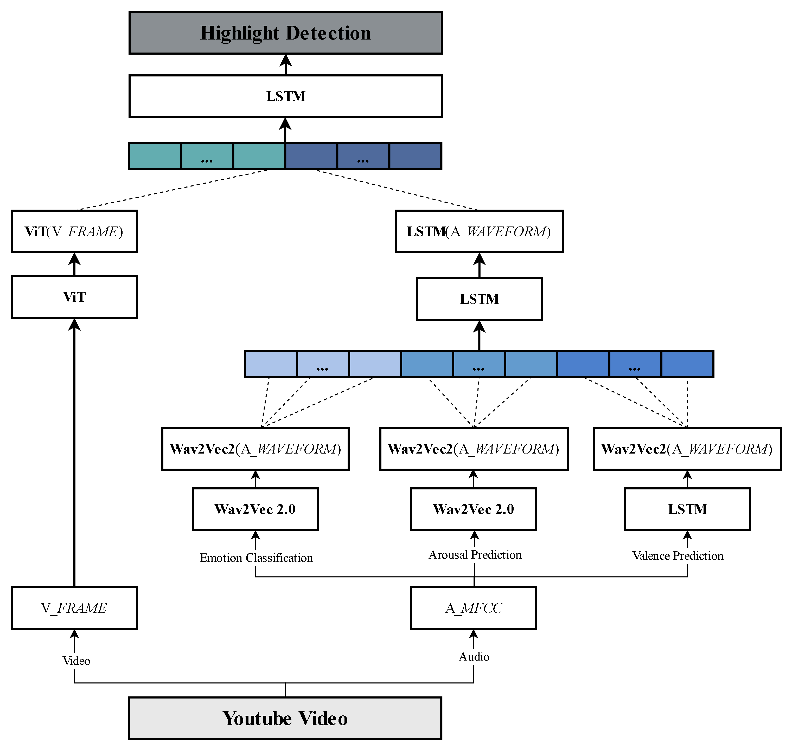
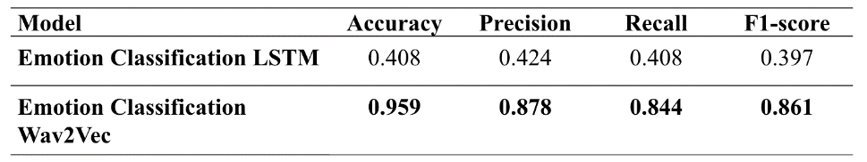
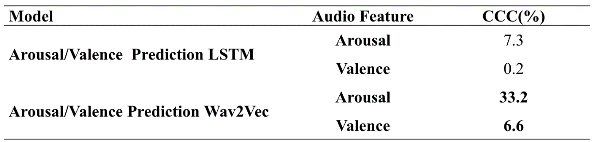
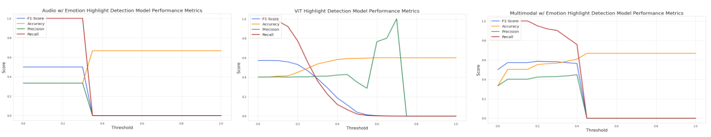
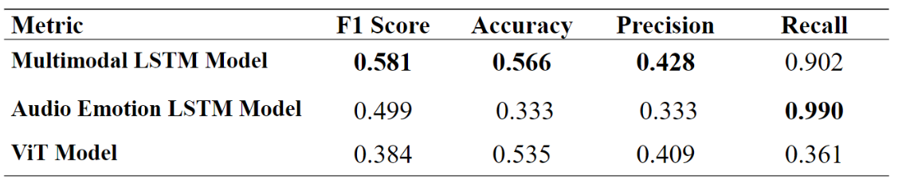

# Emotion-based Multimodal Learning Model for Video Highlight Detection

## Project Introduction

- In this research, we propose **a multimodal model** that simultaneously utilizes _emotional information extracted from audio_ and _images extracted from video_ for video highlight detection. The core idea proposed is to construct a Long Short-Term Memory (LSTM) multimodal model that uses both video frame features extracted by the **Vision Transformer (ViT)** model and emotional features extracted through a model based on **Wav2Vec**, including emotions, arousal, and valence. To demonstrate the effectiveness of the proposed method, we utilize AI HUB's YouTube video dataset to compare the performance of the proposed model with models that utilize only audio or video for highlight detection. The experimental results show that the proposed multimodal model improves the **F1 Score** by approximately **16.43% and 51.3%**, respectively, over models that utilize only audio or video.

## Dataset Introduction and Creation

- **Data 1: ETRI Korean Emotional Dataset KEMDy20 (Spontaneous Speech from the General Public)**

  - **Link**: [KEMDy20\ dataset](https://nanum.etri.re.kr/share/kjnoh/KEMDy20?lang=ko_KR)
  - **Introduction**: A multimodal emotional dataset collected for analyzing the relationship between the speaker's emotions and various signals such as speech audio, contextual meaning of speech, physiological response signals - galvanic skin response, heart-related data, and wrist skin temperature.
  - **Train set**
    - Download path: '01.데이터/2.Validation/원천데이터/VS_유튜브_04'
    - Only use video data from the folder with the smallest size, 21.4GB
  - **Test set**
    - Download path: '01.데이터/2.Validation/원천데이터/VS_유튜브_01'
    - Use only 16 video data files (8 Categories) within the folder
      - Categories: 'Others', 'PetsAndAnimals', 'StylingAndBeauty', 'Sports', 'Trave', 'Food', 'DailyLife', 'Automobile'

- **Data 2: AI HUB Video Content Highlights Editing and Description (Summary) Data**
  - **Link**: [AIHUB\_dataset](https://www.aihub.or.kr/aihubdata/data/view.do?dataSetSn=616)
  - **Introduction**: In './audio_baseline/split_data.ipynb', divide **Train set** and **Test set** into an **8:2** ratio.
  - Create './data_audio/train.csv', './data_audio/test.csv'
  - Divide and save wav files in './data_audio/wav_only/train' and './data_audio/wav_only/test' folders

## Project Structure

## Execution Method

### Model Training and Model Creation

> To concatenate feature vectors to be used in the multimodal approach, create .npy files for audio and video features.

**1.1 LSTM-based Audio Emotion Classification Model**

- run [audio_emotion_baseline_oversampling_SMOTE.ipynb](https://github.com/HwnagYujeong0808/EmotionShortForm-etri_multimodal/blob/main/lstm/audio_emotion_baseline_oversampling_SMOTE.ipynb)
  - _emotion_lstm_features.npy_ Create and save audio emotion features
- run [youtube\_감정분류모델.ipynb](https://github.com/HwnagYujeong0808/EmotionShortForm-etri_multimodal/blob/main/lstm/youtube_%EA%B0%90%EC%A0%95%EB%B6%84%EB%A5%98%EB%AA%A8%EB%8D%B8.ipynb)
  - _lstm_emotion_classification_model.pt_ Save model

**1.2 LSTM-based Audio Arousal Prediction Model**

- run [lstm_arousal.ipynb](https://github.com/HwnagYujeong0808/EmotionShortForm-etri_multimodal/blob/main/lstm/lstm_arousal.ipynb)
  - _arousal_lstm_features.npy_ Create and save arousal features
- run [youtube_Arousal예측모델.ipynb](https://github.com/HwnagYujeong0808/EmotionShortForm-etri_multimodal/blob/main/lstm/youtube_Arousal%EC%98%88%EC%B8%A1%EB%AA%A8%EB%8D%B8.ipynb)
  - _lstm_arousal_model_best.pt_ Save model

**1.3 LSTM-based Audio Valence Prediction Model**

- run [lstm_valence.ipynb](https://github.com/HwnagYujeong0808/EmotionShortForm-etri_multimodal/blob/main/lstm/lstm_valence.ipynb)
  - _valence_lstm_features.npy_ Create and save valence features
- run [youtube_Valence예측모델.ipynb](https://github.com/HwnagYujeong0808/EmotionShortForm-etri_multimodal/blob/main/lstm/youtube_Valence%EC%98%88%EC%B8%A1%EB%AA%A8%EB%8D%B8.ipynb)
  - _lstm_valence_model.pt_ Save model

**2.1 Wav2Vec2-based Audio Emotion Classification Model**

- run [audio_emotion_baseline_oversampling_SMOTE.ipynb](https://github.com/HwnagYujeong0808/EmotionShortForm-etri_multimodal/blob/main/lstm/audio_emotion_baseline_oversampling_SMOTE.ipynb)
  - _emotion_lstm_features.npy_ Create and save voice emotional features
- run [youtube\_감정분류모델.ipynb](https://github.com/HwnagYujeong0808/EmotionShortForm-etri_multimodal/blob/main/lstm/youtube_%EA%B0%90%EC%A0%95%EB%B6%84%EB%A5%98%EB%AA%A8%EB%8D%B8.ipynb)
  - _lstm_emotion_classification_model.pt_ Save model

**2.2 Wav2Vec2-based Audio Arousal/Valence Prediction Model**

- run [lstm_arousal.ipynb](https://github.com/HwnagYujeong0808/EmotionShortForm-etri_multimodal/blob/main/lstm/lstm_arousal.ipynb)
  - _arousal_lstm_features.npy_ Create and store alertness characteristics
- run [youtube_Arousal예측모델.ipynb](https://github.com/HwnagYujeong0808/EmotionShortForm-etri_multimodal/blob/main/lstm/youtube_Arousal%EC%98%88%EC%B8%A1%EB%AA%A8%EB%8D%B8.ipynb)
  - _lstm_arousal_model_best.pt_ Save model

**3. Audio emotion-based highlight extraction LSTM model**

- run [Youtube_feature_concatenate.ipynb](https://github.com/HwnagYujeong0808/EmotionShortForm-etri_multimodal/blob/main/lstm/Youtube_feature_concatenate.ipynb)
  - _concatenate_features_array.npy_ Create and save concatenated audio feature
  - _concatenate_lstm_model.pt_ Save model

**4. Video-based highlight extraction VIT model**

- run [final_vit_video.ipynb](https://github.com/HwnagYujeong0808/EmotionShortForm-etri_multimodal/blob/main/vit/final_vit_video.ipynb)
  - _concatenate_vit_features_array.npy_ Create and save video frame features

**5. Multimodal highlight extraction LSTM model using both video and audio features**

- run [multimodal_lstm_undersampling.ipynb](https://github.com/HwnagYujeong0808/EmotionShortForm-etri_multimodal/blob/main/lstm/multimodal_lstm_undersampling.ipynb)
  - _multimodal_model.pt_ Save model

### model inference
> Evaluate and compare the performance of three models on eight different categories of Test datasets
 
- **1) (Baseline) Audio emotion-based highlight extraction model** 
  - run [final_audio.ipynb](https://github.com/HwnagYujeong0808/EmotionShortForm-etri_multimodal/blob/main/lstm/final_audio.ipynb)
  - Load model
    1) _lstm_emotion_classification_model.pt_
    2) _lstm_arousal_model_best.pt_
    3) _lstm_valence_model.pt_
    4) _concatenate_lstm_model.pt_
  - Measure model performance
    - **_concatenate_lstm_model.pt_** Measure the performance of the baseline model for highlight extraction based on audio emotion using the model.
####
 - **2) (Baseline) Video-based highlight extraction model**
 - run [final_vit_video.ipynb](https://github.com/HwnagYujeong0808/EmotionShortForm-etri_multimodal/blob/main/vit/final_vit_video.ipynb)
 - Measure model performance
    - Measure the performance of an image-based highlight extraction baseline model using **a pre-trained ViT model**
####
- **3) Multimodal highlight extraction model using both video and audio features**
  - run [final_audio+video_best_undersampling.ipynb](https://github.com/HwnagYujeong0808/EmotionShortForm-etri_multimodal/blob/main/lstm/final_audio+video_best_undersampling.ipynb)
  - Load model
    1) _lstm_emotion_classification_model.pt_
    2) _lstm_arousal_model_best.pt_
    3) _lstm_valence_model.pt_
    4) _concatenate_lstm_model_0.001.pt_
    5) _multimodal_model.pt_
  - Measure model performance
    - Using the **_multimodal_model.pt_** model, measure the performance of a multimodal model that utilizes both voice emotion and video features proposed in the project

## Results

### Performance comparison of LSTM/Wav2Vec based audio emotion classification model and voice arousal prediction model

### Highlight extraction model performance comparison
+ **Threshold**
   + Multimodal highlight extraction model threshold: 0.3
   + Audio-based highlight extraction model threshold: 0.3
   + Video-based highlight extraction model threshold: 0.3

+ **Final result**

+ **Multimodal LSTM Model**:  Multimodal highlight extraction model using both video and audio features
+ (Baseline) Audio LSTM Model: Audio emotion-based highlight extraction model
+ (Baseline) ViT Model: Video-based highlight extraction model

