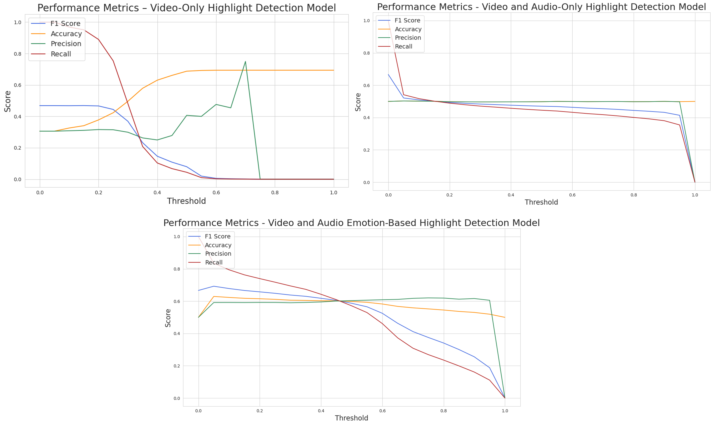

# Emotion-based Multimodal Learning Model for Video Highlight Detection

## Project Introduction

- In this research, we propose **a multimodal model** that simultaneously utilizes _emotional information extracted from audio_ and _images extracted from video_ for video highlight detection. The core idea proposed is to construct a Long Short-Term Memory (LSTM) multimodal model that uses both video frame features extracted by the **Vision Transformer (ViT)** model and emotional features extracted through a model based on **Wav2Vec**, including emotions, arousal, and valence. To demonstrate the effectiveness of the proposed method, we utilize AI HUB's YouTube video dataset to compare the performance of the proposed model with models that utilize only audio or video for highlight detection. The experimental results show that the proposed multimodal model improves the **F1 Score** by approximately **16.43% and 51.3%**, respectively, over models that utilize only audio or video.

## Dataset Introduction and Creation

- **Data 1: ETRI Korean Emotional Dataset KEMDy20 (Spontaneous Speech from the General Public)**

  - **Link**: [KEMDy20\ dataset](https://nanum.etri.re.kr/share/kjnoh/KEMDy20?lang=ko_KR)
  - **Introduction**: A multimodal emotional dataset collected for analyzing the relationship between the speaker's emotions and various signals such as speech audio, contextual meaning of speech, physiological response signals - galvanic skin response, heart-related data, and wrist skin temperature.
  - **Train set**
    - Download path: '01.데이터/2.Validation/원천데이터/VS_유튜브_04'
    - Only use video data from the folder with the smallest size, 21.4GB
  - **Test set**
    - Download path: '01.데이터/2.Validation/원천데이터/VS_유튜브_01'
    - Use only 16 video data files (8 Categories) within the folder
      - Categories: 'Others', 'PetsAndAnimals', 'StylingAndBeauty', 'Sports', 'Trave', 'Food', 'DailyLife', 'Automobile'

- **Data 2: AI HUB Video Content Highlights Editing and Description (Summary) Data**
  - **Link**: [AIHUB\_dataset](https://www.aihub.or.kr/aihubdata/data/view.do?dataSetSn=616)
  - **Introduction**: In './audio_baseline/split_data.ipynb', divide **Train set** and **Test set** into an **8:2** ratio.
  - Create './data_audio/train.csv', './data_audio/test.csv'
  - Divide and save wav files in './data_audio/wav_only/train' and './data_audio/wav_only/test' folders

## Project Structure

## Execution Method
# Multimodal Highlight Detection – Implementation Guide

This repository contains the full implementation of our multimodal highlight detection system, integrating video, audio, and emotional cues. The pipeline is modular, reproducible, and ready for real-world use cases.

---

## Implementation Steps

### Audio-only Pipeline

| Notebook | Description |
|----------|-------------|
| `a_0_create_wav.ipynb` | Convert raw audio into `.wav` format |
| `a_1_Wav2Vec2_arousal_valence_prediction.ipynb` | Predict arousal and valence using Wav2Vec2 |
| `a_1_Wav2Vec2_emotion_classification.ipynb` | Classify discrete emotions using Wav2Vec2 |
| `a_2_extract_waveform_A_av_mul_data.ipynb` | Extract audio features (Wav2Vec2) for A/V/MUL datasets |
| `a_3_training_evaluation_waveform_A.ipynb` | Train and evaluate audio-only highlight detection |
| `a_3_training_evaluation_waveform_AE.ipynb` | Train and evaluate audio + emotion-based model |

---

### Video-only Pipeline

| Notebook | Description |
|----------|-------------|
| `v_0_create_video_dataset.ipynb` | Preprocess and organize raw video data |
| `v_1_extract_vit_features_av.ipynb` | Extract ViT-based features from AV dataset |
| `v_1_extract_vit_features_mul.ipynb` | Extract ViT-based features from MUL dataset |
| `v_2_Evaluation_video_model.ipynb` | Evaluate highlight detection using video features |

---

### Multimodal Pipeline

| Notebook | Description |
|----------|-------------|
| `m_1_multimodal_AE_V_waveform_pad.ipynb` | Train and evaluate model using Audio (w/ Emotion) + Visual features |
| `m_1_multimodal_A_V_waveform_pad.ipynb` | Train and evaluate model using Audio-only + Visual features |

→ Combine video + audio (A_V) or video + audio + emotion (AE_V)

---

## Results

### Highlight detection model performance comparison

+ **Final result**

| **Features**                     | **F1 Score** | **Precision** | **Recall** |
|----------------------------------|--------------|----------------|------------|
| Video                            | 0.384        | 0.409          | 0.361      |
| Audio Only                       | 0.409        | 0.369          | 0.458      |
| Audio + Emotion                  | 0.501        | 0.340          | 0.955      |
| Video + Audio Only              | 0.484        | 0.497          | 0.471      |
| **Video + Audio + Emotion (Ours)** | **0.638**    | **0.590**      | **0.695**  |

  

+ **Multimodal LSTM Model**: Video and audio emotion-based multimodal highlight detection model
+ (Baseline) Audio LSTM Model: Audio emotion-based highlight detection model
+ (Baseline) ViT Model: Video-based highlight detection model

